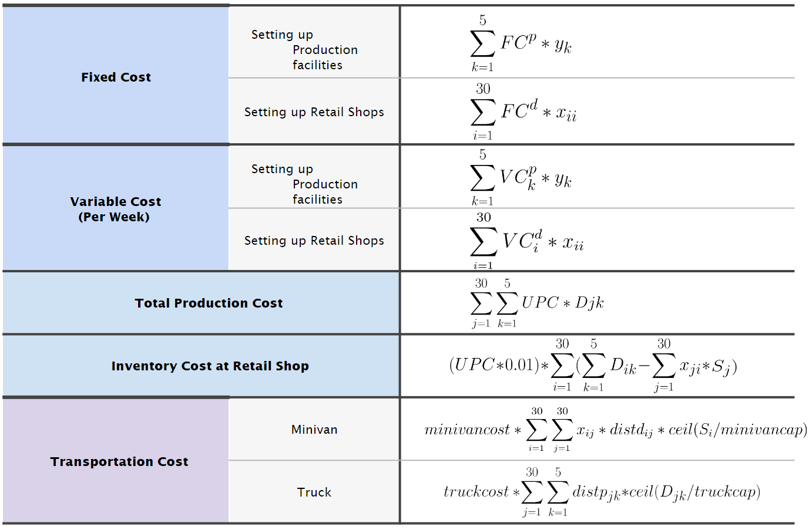
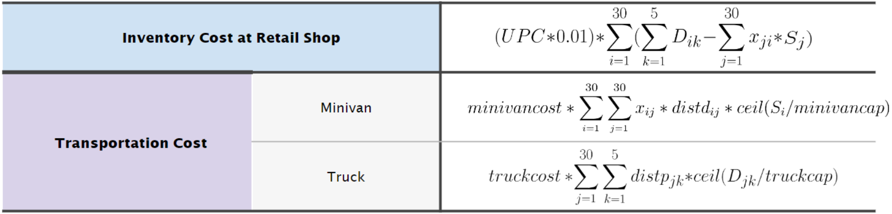

# Supply Chain Network and Distribution solution

## Introduction
The following project is an attempt to give a solid solution to a real life case study problem in Distribution Network.

#### A brief explanation of the problem statement is as follows:

- A company wishes to launch a product.
- The company has 5 production sites planned and has 30 districts where it can open retail store per district.
- The company has surveys of all the districts according to the wishes of customers, whether they are willing to adopt the product or not?
- The survey is in the form of: **Yes, No** and **Maybe.**
- The company also has details of distances between the districts and distances between production sites to districts.
- There is a fixed cost of opening a retail store in districts and fixed cost of opening a production site.
- Demand of a different district can be fulfilled via a van facility from a retail store if the given district does not have a retail store.
- The goods are transported to retail store via a truck with a fixed max capacity and a transportation cost.
- Based on given information, company has to make a decision on the loaction of opening the retail stores, location of opening the production sites owing to the minimum cost it will incur and maximum profit they may gain.

The complete problem statement is uploaded.

## Aim
Analyze the network design and distribution decisions of a 
company, ABC and help them establish its supply network and 
distribution plans to market its product in city XYZ. 

## Details

### Retail Stores
- Each retail store has an assigned set of districts that it caters to and can deliver only to those districts.
- Each store incurs operating costs on a weekly basis. They incur operating costs as fixed and variable (depending on district) costs. Pre-specified number of daily sales to remain profitable.
- Retail stores if present, are set up around the middle of the district that it is assigned to.
- Stores use minivans to deliver product to their customers. They incur costs per mile. It is done on a daily basis.
- Inventory costs applicable.

### Production Facilities
- There is no restriction on the number of retail stores assigned to a facility and vice versa.
- Each facility has a maximum production capacity. Production facilities incur operating costs as fixed and variable costs.
- Facilities are to be set-up on the outskirts of the city, in a suburban area.
- Facilities use trucks to supply retailers and can be made to deliver on a daily basis. It incurs costs per mile.
- Inventory costs negligible.

## Concepts Used

The following Concepts were used to solve the problem:

- Network Distribution
- p-median algorithm
- Fixed Charge algorithm

### Network Distribution
Distribution is the process of moving and storing a product through the supply chain from the supplier stage to the consumer stage. It has a significant impact on both the cost of the supply chain and the customer experience, which makes it a major factor in a company's total profitability.

A supply chain's distribution network is made up of a connected system of warehouses and transportation hubs that receive inventories of products before distributing them to customers.

### p-median algorithm

A particular kind of discrete location model is the p-median problem. We want to position the facilities in this model to reduce the overall cost of transportation to the various sites. This approximates the entire cost of delivery. There are no facility capacity restrictions in this concept.

This model is used to find the optimal layout among the different potential districts which may serve as facilities/retail shops in the network. 

Finding potential sites for setting up facilities is more of a qualitative problem where different factors like raw material, labour availability, proximity to demand points, transportation, government policies and incentives must be considered.

### Fixed Charge algorithm

The fixed-charge problem deals with situations in which the economic activity incurs two types of costs: an initial fixed fee that must be incurred to start the activity and a variable cost that is directly related to the level of the activity

C(x) = Fixed Cost + Variable Cost ; x>0

In our problem, the retailer stores are standardized, i.e., they have the same capacities and same operating costs. For operating a store, there are two parts of cost in each week, fixed weekly operating cost that is the same for any production sites(e.g., labor cost) and additional weekly cost that is different among different sites(e.g., rental). The total operating costs of having a store in a district is the sum of the two if there is a production plant at the site.

## Formulation

### Formulation Process

Demand Generation --> Determining Decision Variables --> Formulation of Objective function --> Formulating Constraints

### Demand Generation from Survey

90% -> From people who said **definitely yes**

70% -> From people who said **yes**

45% -> From people who said **maybe**

### Decision Variables

### Other Factors

### Objective function 

### Constraints

## Solution

### CPLEX Code

### Solution Analysis

